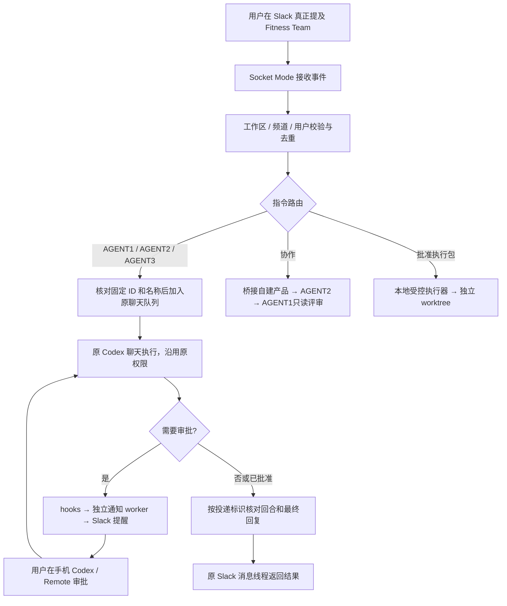

# Slack → 本地 Codex bridge：全过程

## 1. 目标与最终方案

目标是让人在 Slack 向本地已有 Codex 聊天发布任务，保留同一聊天的历史、权限和项目约束；需要批准时提醒用户在手机处理，之后将结果返回 Slack。

最终采用 **Slack Socket Mode + 固定原聊天 ID + 本机消息队列**。bridge 只把指令加入原聊天队列，由原聊天的执行连接继续处理，不通过另一个服务抢占原聊天的写入权。队列投递不会新增文件或命令权限。

Socket Mode 由本机主动连接 Slack WebSocket，不需要开放公网 HTTP 接收端口。[Slack 官方说明](https://docs.slack.dev/apis/events-api/using-socket-mode/)

## 2. 四种能力分别是什么

| 能力 | 谁执行 | 历史与权限 | 验证边界 |
|---|---|---|---|
| 桥接自建角色协作 | bridge 创建/继续的 Codex 角色会话 | 独立于桌面原聊天；只读评审 | 协作返回正常不证明原桌面 Agent 收到指令 |
| 原聊天双向通信 | 桌面原聊天持有的执行连接 | 固定原 ID，沿用原聊天历史和审批 | 入队、执行、最终回复、Slack 反馈分别确认 |
| 桌面审批和结束通知 | hooks 捕获事件，worker 发 Slack | 不返回批准决定 | 通知成功不证明 Slack 可反向控制 |
| Executor 批准执行 | 本地宿主校验模型提出的结构化修改 | 精确文件范围，独立 worktree | 离线模拟通过不代表真实业务验收 |

ChatGPT 部分只记录结论：本次尝试未能成功连接原产品经理聊天。

## 3. 方案演进

以下为原聊天及产物中的历史事实，日期统一使用北京时间。底层日志是 UTC，因此某些安装目录名比日志日期晚一天。

### 阶段一：已有只读桥接与 0.2.0 受控执行（10 月 4 日）

最初桥接提供产品、AGENT2、AGENT1三个独立角色，以及最多三次调用的串行“协作”。本地只读文件快照和上游结论被交给下一角色，不接管桌面原聊天。

原聊天开始时已有 0.1.3。随后明确选择受控落盘：模型返回结构化修改，本地执行器校验后写入独立 executor worktree；模型不获得任意 shell 执行能力。

批准包绑定身份、Slack 线程、基线、精确文件列表、包 hash、有效期和一次性执行状态。执行前持久化 claim，结束后先持久化结果再发 Slack；崩溃或发消息失败不能导致重复模型执行。

加固包括工具目录过滤、完整 SSE 验证、继承配置检查、Windows 句柄锁定、拒绝 reparse/hardlink 路径。升级首次被旧守护程序健康检查误判失败，安装器恢复 0.1.3；保留旧健康标记后成功安装 0.2.0。安装后历史记录为 120/120 离线测试通过、真实 SDK 固定响应模拟落盘成功、回滚预检通过。没有真实模型写入、提交、推送或部署验证。

### 阶段二：从 Slack 直接审批转为通知 + 手机审批

最初需求是从 Slack 批准 Codex 桌面的权限弹窗。0.2.1 候选只处理 bridge 自己持有的请求，并仅允许既有范围内的只读权限；18 项新增测试通过，但全套 130/138 通过，因此未安装。它不能接管任意桌面原聊天的弹窗。

用户随后将需求改为：需要批准时 Slack 文字提醒，手机批准，执行结束后告知。于是部署独立通知程序，注册并信任 `PreToolUse`、`PermissionRequest`、`PostToolUse`、`Stop`、`SubagentStop`、`Interrupt` hooks。

通知捕获过真实审批等待和结束简报。之后在独立桌面测试聊天验证手机批准，并核对批准后的固定回复和 Slack 简报，完成该链路实测。hooks 本身不读机器人凭据、不联网、不返回审批决定；worker 使用本地配置发通知。

### 阶段三：确认“桥接角色”不等于“桌面原 Agent”

用户要求产品、AGENT2、AGENT1对应现有聊天。最初把三条示例放入同一 Slack 消息，被当作一个任务；角色协作结果也只来自桥接自己的会话。由此明确成功标准必须包含“消息出现在固定原聊天中”。

核实 AGENT2 和AGENT1的固定 ID；产品经理后来确认属于普通 ChatGPT。最初原聊天路由先明确报告“未投递”，防止静默落到新的角色会话。

### 阶段四：连接控制接口和失败的恢复路线

本机 Codex/SDK 基线为 0.160.0。`app-server proxy` 探针最初在 initialize 超时；补上 WebSocket Upgrade 握手后连接成功。独立 daemon 能读取原 ID，但显示 `notLoaded`，不能由此认为桌面聊天没运行。

桌面服务使用内部 stdio 连接，独立 daemon 使用可连接的控制 socket。能读保存记录不等于持有桌面写入连接。

恢复测试先备份原聊天、索引一致性快照、hooks、bridge，并记录 Fitness 的七个 worktree 状态。过程中出现响应大小限制、RPC 参数错误和恢复拒绝；原记录和项目状态均保留。

曾把原 AGENT2 恢复失败归因于 `paginated` 历史，后发现 `readOnly` 参数也写错；因此这不是可确定的唯一根因。独立新聊天测试还经历空聊天未持久化、过时权限字段、source filter 不匹配、侧栏不可见等问题。

独立测试聊天后来实现 Slack 往返及持久化，但桌面可见性仍未验证。桌面新建的“明确测试内容”则明确报 `already has an active writer`；切换聊天没有释放占用。停止恢复接管路线，没有强杀进程、删锁或改历史来源。

### 阶段五：用队列接入原桌面聊天（10 月 5 日凌晨）

本机 0.160.0 schema 中发现 `thread/queue/*`。连接声明 `experimentalApi:true` 后，队列只读查询成功。向桌面测试聊天调用 `thread/queue/add`，消息出现在原聊天并由其回复，无需 `thread/resume` 或启动另一执行连接。

随后先接 Slack 固定测试入口：原聊天收到了消息并回复，但 bridge 曾误报 FAILED。修复“等待最终答复”的结果判断；再解决 PowerShell 脚本编码、JSON 读取编码和 JSON BOM，历史测试终于完整返回 SUCCEEDED。

扩展到AGENT1和 AGENT2：核对 ID、名称、队列、历史路径并备份；修复 Windows `\\?\` 路径误判。两角色投递成功，但曾把短暂 `interrupted` 当终态；补上终态稳定性判断、状态重新核验和混合角色指令拒绝，之后分别返回 `TURN_COMPLETED` 与原聊天最终答复。

### 阶段六：便携路径、自启动与AGENT3

去掉用户目录硬编码，按当前 Windows 用户定位 daemon/socket；登记用户登录后的启动入口。启动检查曾通过，实际重启往返仍未做。

ChatGPT：本次尝试未能成功连接原产品经理聊天，不展开其接入路线。

AGENT3 最初通过 Slack 连接器发“你好”，只证明出站成功。加入真正的AGENT3队列路由后，安装因复制旧离线测试临时目录而触发 262 字符长路径；改为只复制正式测试文件后安装成功。

2026-10-05 01:19，北京时间，原AGENT3聊天收到带 `SlackDelivery-…` 的 Slack 指令并回复“你好，已收到”。这直接证明消息进入原聊天。本轮读取状态文件还确认该投递为 TURN_COMPLETED 且有回复，见证据文档。

## 4. 最终角色绑定

| Slack 指令 | 原聊天 | 固定 ID | 结果 |
|---|---|---|---|
| `AGENT1：…` | `ORIGINAL_AGENT1_TITLE` | `THREAD_ID_AGENT1` | 历史联调往返通过 |
| `AGENT2：…` | `ORIGINAL_AGENT2_TITLE` | `THREAD_ID_AGENT2` | 历史联调往返通过 |
| `AGENT3：…` | `AGENT3` | `THREAD_ID_AGENT3` | 原聊天收到并回复；当前源码包含绑定 |
| 原产品经理 | ChatGPT 原聊天 | 已识别，仓库不保留私人网址 | 未接入；不能替换成新 Codex 聊天冒充 |

ID 是旧机器部署事实，不是可直接搬到其他机器的配置。名称变化也可能触发身份校验失败；不能仅改一处 ID 绕过校验。

## 5. 原聊天路由内部顺序

1. 上游校验 Slack 工作区、频道、允许用户并去重。
2. 解析真正提及和单角色指令；拒绝混合角色正文。
3. 根据 Slack team/channel/messageTs/user 生成 deliveryId；已有记录不重投。
4. 核对原聊天固定 ID 和名称；检查队列为空、旧任务已确认终态、配额允许。
5. 先落盘 `CLAIMED` 与角色锁，再向队列写入带唯一 `SlackDelivery-…` 的消息。
6. 收到队列确认后保存 `QUEUED`，向 Slack 报告等待执行。
7. 用 marker 查原聊天回合；确认 completed 和 final_answer 后保存 `TURN_COMPLETED`。
8. 超时保存 `PENDING`；异常可能为 `UNKNOWN`。通过状态查询核对已有回合，不自动重投。
9. 最终回复与回合状态返回原 Slack 线程，业务成功仍需独立验收。

当前源码对 failed/interrupted 的相同签名需要五次观察才认作稳定终态；completed 必须出现 final_answer。这个实现缓解历史误报，不保证任何未来版本都没有状态竞态。

## 6. 权限原则

原聊天指令携带“遵循已有权限、审批要求和项目约束；不额外授予权限”。因此原聊天可用能力由其已有配置决定，不能将桥接自建角色的只读限制误说成原聊天的强制只读保证。

Executor 执行包批准、Codex 权限卡片批准、Slack 队列发布任务是三件事。除非分别验证，不互相替代。协议和客户端可能变化，实验性队列能力应以部署版本 schema 和实际往返为准；本轮官方公开 App Server 页未检索到 `thread/queue/add`，其细节依据本机源码及历史实测。
