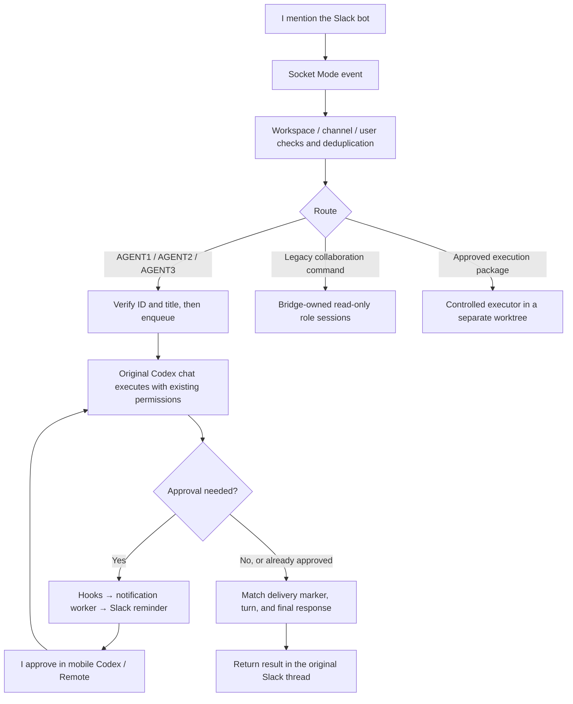

# Slack → Local Codex Bridge: The Complete Process

[中文版](../zh/01-process.md)

## 1. Goal and final design

I wanted to send tasks from Slack into existing local Codex chats and keep their history, permissions and project constraints. When approval was needed, I wanted a Slack reminder, approval on my phone and a reply in Slack when execution finished.

I settled on **Slack Socket Mode, fixed original thread IDs, and the local thread queue**. The bridge adds a submission; the original chat's writer processes it. It does not resume the chat in another server or acquire its writer connection. Posting a task grants no additional permissions.

I used Socket Mode to establish an outbound WebSocket connection without a public HTTP event endpoint. [Slack documentation](https://docs.slack.dev/apis/events-api/using-socket-mode/)

## 2. The four capabilities I kept separate

| Capability | Who runs it | History and permissions | What the test shows |
|---|---|---|---|
| Bridge-owned collaboration | Independent Codex role sessions | Separate history; read-only reviews | Role-like answers do not prove original chats received a task |
| Original-chat communication | Original desktop chat's writer | Fixed original ID; original permissions | Verify enqueueing, execution, final answer, and Slack feedback separately |
| Approval/completion notifications | Hooks and a separate worker | No approval decision is returned | Outbound notifications do not prove inbound control |
| Controlled execution | Host validates structured edits | Exact file scope; dedicated worktree | Offline execution is not live-model or business acceptance |

I could not connect the original ChatGPT Web chat.

## 3. How the solution developed

### Phase 1: Read-only collaboration and controlled execution

I initially used the bridge to create independent AGENT3, AGENT2 and AGENT1 roles. A collaboration task made up to three calls in sequence, passing read-only file snapshots and the previous role’s findings to the next role. These were not the desktop's original chats.

I started with version 0.1.3 and added controlled file writes: Codex proposes structured edits; the host validates them and writes into a separate executor worktree. The model does not receive arbitrary shell access.

I included the approver, Slack thread, base revision, exact paths, hash, expiration and one-time state in each execution package. I made the executor save a claim before execution and the result before Slack feedback, so a crash or feedback failure would not replay model execution.

I added safeguards for filtering both tool catalogs, validating complete SSE responses, restricting inherited configuration, using native Windows handles, and rejecting reparse/hardlink paths. The first 0.2.0 installation failed a legacy health check and restored 0.1.3. I preserved the old health marker while reporting the actual version, which allowed the upgrade.

I checked the post-install records: 120/120 offline tests, a real SDK with a fixed local response performing one controlled write, and rollback prechecks. I did not test live-model writes, business acceptance, commits, pushes or deployments.

### Phase 2: From direct Slack approval to reminders plus mobile approval

I initially wanted to approve desktop permission dialogs from Slack. The 0.2.1 candidate could only respond to bridge-owned requests, within existing read-only scope. Its 18 new tests passed, but the full suite passed only 130/138, so I did not install it. It could not approve arbitrary desktop dialogs.

I switched to Slack reminders, mobile approval and completion notifications. I deployed a separate notifier and registered and trusted `PreToolUse`, `PermissionRequest`, `PostToolUse`, `Stop`, `SubagentStop`, and `Interrupt` hooks.

I received approval reminders and turn summaries. In a separate desktop test chat, I then verified mobile approval, the expected post-approval response and the Slack summary. The hook writes an event without reading bot credentials or returning an approval decision; the worker sends notifications using local configuration.

### Phase 3: Separating role identity from original-chat identity

I wanted to connect the existing AGENT1 and AGENT2 Codex chats and an original ChatGPT Web chat. I first put three example commands in one Slack message, which the bridge treated as one task. Collaboration answers also came from bridge-owned sessions. I made the message appearing in the intended original chat a requirement for communication acceptance.

I checked the AGENT1 and AGENT2 IDs and confirmed that the other target chat was in ChatGPT Web. I could not connect it. I made the early original-chat route report “not delivered” instead of silently falling back to independent role sessions.

### Phase 4: Control connection and unsuccessful resume attempts

I used CLI/SDK version 0.160.0. The proxy probe initially timed out at initialize; I implemented WebSocket Upgrade and the connection worked. The independent daemon could read saved original threads but reported `notLoaded`. That did not mean the desktop agents were idle or absent.

I found that the desktop used an internal stdio server connection while the daemon exposed a control socket. I could read stored records, but that did not give me ownership of the desktop's writer.

Before testing resume, I backed up the original chat logs, a consistent index snapshot, hooks and bridge files, and recorded the business worktree states. Tests encountered a response-size limit, invalid permission parameters, and resume rejection; original files and project state were preserved.

I initially attributed one rejection to `paginated` history. I later found that `readOnly` was also wrong for the deployed method, so I could not establish history format as the sole cause. In new isolated threads, I also encountered empty threads not persisting, outdated permission fields, source filtering, and desktop visibility.

I eventually completed Slack round trips and persisted history in an independent test thread, but did not verify desktop visibility. A desktop-created test chat explicitly rejected resume with `already has an active writer`. I switched chats, but that did not release it. I stopped the resume attempts and preserved the processes, locks and history/source metadata.

### Phase 5: Queue submissions to the original desktop chat

I found `thread/queue/*` in the local 0.160.0 schema. I enabled `experimentalApi:true` during initialize and successfully inspected the queue without writing. I then submitted a task with `thread/queue/add`; it appeared in the desktop-created original test chat and was processed by its writer, without resume or a second execution connection.

I first added Slack's fixed test route. The original chat replied correctly, but the bridge reported FAILED. I repaired the final-response wait logic and fixed PowerShell script encoding, JSON decoding and BOM handling. The stored test then returned SUCCEEDED.

I verified and backed up the AGENT1 and AGENT2 bindings. A Windows `\\?\` prefix caused a path-boundary false rejection which I fixed by normalizing the prefix while keeping the boundary check. Both original agents received tasks, but an early `interrupted` observation was mistaken for a terminal result. I added stable terminal checks, status revalidation and rejection of mixed-role commands. Both roles subsequently returned `TURN_COMPLETED` and their original final answers.

### Phase 6: Portable paths, startup, and AGENT3

I replaced hardcoded user paths with daemon/socket discovery for the current Windows account. I registered and checked login startup, but did not test a round trip after an actual reboot.

I first sent an AGENT3 greeting through the Slack connector, which only proved outbound messaging. I then added the AGENT3 queue route. Installation first copied old offline-test temporary data, reaching a 262-character path. I fixed the installer by copying only formal test files.

I then confirmed that the original AGENT3 chat received a `SlackDelivery-…` message and replied. The stored record also contains `TURN_COMPLETED` and the reply. I verified communication, but did not verify business results.

## 4. Anonymized binding template

| Document role | Original chat title placeholder | Thread ID placeholder | Historical result |
|---|---|---|---|
| AGENT1 | ORIGINAL_AGENT1_TITLE | THREAD_ID_AGENT1 | Original-chat round trip verified |
| AGENT2 | ORIGINAL_AGENT2_TITLE | THREAD_ID_AGENT2 | Original-chat round trip verified |
| AGENT3 | ORIGINAL_AGENT3_TITLE | THREAD_ID_AGENT3 | Original chat received and replied; completion record checked |
| ChatGPT Web | Original web chat | Private URL omitted | Not connected; a new Codex chat cannot substitute for it |

I replaced the IDs and titles with anonymized placeholders; they cannot be used as configuration. A renamed chat can fail identity checks, and a new or forked chat has a different ID. I check the parser, role mapping and transport allowlist together.

## 5. The original-chat route I used

I made the route process each message in this order:

1. Verify Slack workspace/channel/user and deduplicate the event.
2. Parse an actual mention and one role; reject mixed-role text.
3. Derive deliveryId from Slack team/channel/message timestamp/user; never resend an existing record.
4. Verify fixed ID and title, an empty queue, confirmed prior state, and quota.
5. Persist CLAIMED and the role lock before queue/add; include a unique SlackDelivery marker.
6. Persist QUEUED after acknowledgement and report that execution is pending.
7. Find the marked turn; require completed plus final_answer before TURN_COMPLETED.
8. Persist PENDING on timeout; uncertain failures may be UNKNOWN. Status queries re-read the existing turn rather than resubmitting it.
9. Return the final response in the source Slack thread; independently verify business acceptance.

I required five identical failed/interrupted observations before confirming failure or interruption; completed also requires final_answer. This fixed the races I saw in testing. Later versions may behave differently.

## 6. Permissions

I added an instruction to preserve the existing chat permissions, approval rules and project constraints. Original chats are not forced read-only simply because bridge-owned roles are read-only.

I treat queue submission, executor package approval and Codex permission-card approval as three separate checks. Protocols and clients can change, so I use the deployed schema and actual round trips to assess the experimental queue. I did not find `thread/queue/add` on the public App Server page and used deployed source and test results to check its details. I cannot treat it as a stable public API across versions. [App Server documentation](https://learn.chatgpt.com/docs/app-server)
