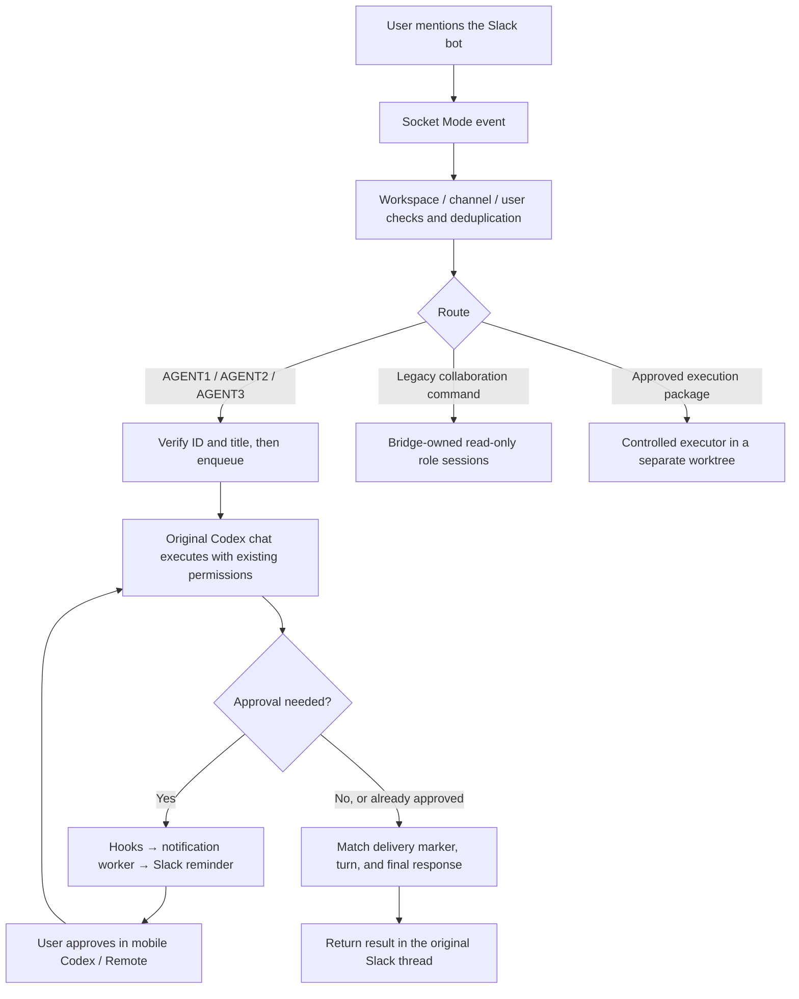

# Slack → Local Codex Bridge: The Complete Process

[中文版](../01-process.md) · Prepared on 2026-10-05, Asia/Shanghai.

## 1. Goal and final design

The goal was to send tasks from Slack into existing local Codex chats, preserve their history and permissions, notify the user when approval was needed, and return the response to Slack after the user approved on their phone.

The final route uses **Slack Socket Mode, fixed original thread IDs, and the local thread queue**. The bridge adds a submission; the original chat's writer processes it. It does not resume the chat in another server or acquire its writer connection. Posting a task grants no additional permissions.

Socket Mode establishes an outbound WebSocket connection, so this design needs no public HTTP event endpoint. [Slack documentation](https://docs.slack.dev/apis/events-api/using-socket-mode/)

## 2. Four distinct capabilities

| Capability | Execution owner | History and permissions | Evidence boundary |
|---|---|---|---|
| Bridge-owned collaboration | Independent Codex role sessions | Separate history; read-only reviews | Role-like answers do not prove original chats received a task |
| Original-chat communication | Original desktop chat's writer | Fixed original ID; original permissions | Verify enqueueing, execution, final answer, and Slack feedback separately |
| Approval/completion notifications | Hooks and a separate worker | No approval decision is returned | Outbound notifications do not prove inbound control |
| Controlled execution | Host validates structured edits | Exact file scope; dedicated worktree | Offline execution is not live-model or business acceptance |

ChatGPT scope: this attempt did not successfully connect the original ChatGPT chat. This handbook focuses on Codex and Slack.

## 3. Evolution of the solution

These are historical observations from the source chat and installation artifacts. Dates below use Beijing time; source log timestamps use UTC, so some installation directory names fall on the following date.

### Phase 1: Read-only collaboration and controlled execution

The initial bridge used independent product, AGENT2, and AGENT1 roles. A collaboration task ran a bounded sequence, forwarding read-only file snapshots and upstream findings. These were not the desktop's original chats.

The source chat began with version 0.1.3. The user then chose controlled file writes: Codex proposes structured edits; the host validates them and writes into a separate executor worktree. The model does not receive arbitrary shell access.

Execution packages bind the user, Slack thread, base revision, exact paths, hash, expiration, and one-time state. A claim is persisted before execution; terminal results are persisted before Slack feedback. Crashes and feedback failures must not replay model execution.

Hardening included filtering both tool catalogs, validating complete SSE responses, restricting inherited configuration, using native Windows handles, and rejecting reparse/hardlink paths. The first 0.2.0 installation failed a legacy health check and restored 0.1.3. Preserving the old health marker while reporting the actual version allowed the upgrade.

Historical post-install evidence: 120/120 offline tests, a real SDK with a fixed local response performing one controlled write, and rollback prechecks. Live-model writes, business acceptance, commits, pushes, and deployments were not tested.

### Phase 2: From direct Slack approval to reminders plus mobile approval

The original request was to approve desktop permission dialogs from Slack. The 0.2.1 candidate could only respond to bridge-owned requests, within existing read-only scope. Its 18 new tests passed, but the full suite passed only 130/138, so it was not installed. It could not approve arbitrary desktop dialogs.

The user changed the requirement: Slack should describe the need for approval, the phone should approve, and Slack should report the end of execution. A separate notifier registered and trusted `PreToolUse`, `PermissionRequest`, `PostToolUse`, `Stop`, `SubagentStop`, and `Interrupt` hooks.

Real approval reminders and turn summaries were observed. A separate desktop test chat later verified mobile approval, the expected post-approval response, and the Slack summary. The hook writes an event without reading bot credentials or returning an approval decision; the worker sends notifications using local configuration.

### Phase 3: Separating role identity from original-chat identity

The user wanted existing chats rather than newly created role sessions. Three example commands in one Slack message were initially treated as one task. Collaboration answers also came from bridge-owned sessions. The acceptance criterion therefore became: the message must appear in the intended original chat, identified by its fixed ID.

AGENT1 and AGENT2 IDs were checked. The third requested product chat belonged to ChatGPT and was not connected. Early route candidates explicitly said “not delivered” rather than silently falling back to independent roles.

### Phase 4: Control connection and unsuccessful resume attempts

The local CLI/SDK baseline was 0.160.0. The proxy probe initially timed out at initialize; implementing WebSocket Upgrade made the connection work. The independent daemon could read saved original threads but reported `notLoaded`. That did not mean the desktop agents were idle or absent.

The desktop used an internal stdio server connection; the daemon exposed a control socket. Reading stored records did not provide ownership of the desktop's writer.

Before resume tests, the original chat logs, a consistent index snapshot, hooks, and bridge files were backed up, and seven business worktrees were recorded. Tests encountered a response-size limit, invalid permission parameters, and resume rejection; original files and project state were preserved.

One rejection was initially attributed to `paginated` history. A later discovery showed `readOnly` was also wrong for the deployed method, so history format was not established as the sole cause. New isolated threads exposed other issues: empty threads not persisting, outdated permission fields, source filtering, and desktop visibility.

An independent test thread eventually completed Slack round trips and persisted history, but visibility in the desktop remained unverified. A desktop-created test chat explicitly rejected resume with `already has an active writer`. Switching chats did not release it. The resume route was stopped without killing processes, deleting locks, or changing history/source metadata.

### Phase 5: Queue submissions to the original desktop chat

The local 0.160.0 schema exposed `thread/queue/*`. After initialize opted into `experimentalApi:true`, read-only queue inspection succeeded. A `thread/queue/add` submission appeared in the desktop-created original test chat and was processed by its writer, without resume or a second execution connection.

Slack's fixed test route was added first. The original chat replied correctly, but the bridge reported FAILED. Final-response waiting was repaired; PowerShell script encoding, JSON decoding, and BOM problems were also fixed. The stored test then returned SUCCEEDED.

AGENT1 and AGENT2 bindings were verified and backed up. A Windows `\\?\` prefix caused a path-boundary false rejection and was normalized without removing the boundary check. Both original agents received tasks, but an early `interrupted` observation was mistaken for a terminal result. Stable terminal checks, status revalidation, and mixed-command rejection were added. Both roles subsequently returned `TURN_COMPLETED` and their original final answers.

### Phase 6: Portable paths, startup, and AGENT3

Hardcoded user paths were replaced with current-user daemon/socket discovery. User-login startup was registered and checked; an actual reboot round trip remained untested.

The ChatGPT connection attempt was unsuccessful and is not expanded here.

An initial AGENT3 greeting sent through the Slack connector only proved outbound messaging. The actual AGENT3 queue route was then added. Installation first copied old offline-test temporary data, reaching a 262-character path. Copying only formal test files fixed the installer.

At 01:19 on 2026-10-05 Beijing time, the original AGENT3 chat received a `SlackDelivery-…` message and replied. This run also read the stored `TURN_COMPLETED` record with a reply. This verifies communication, not business results.

## 4. Anonymized binding template

| Document role | Original chat title placeholder | Thread ID placeholder | Historical result |
|---|---|---|---|
| AGENT1 | ORIGINAL_AGENT1_TITLE | THREAD_ID_AGENT1 | Original-chat round trip verified |
| AGENT2 | ORIGINAL_AGENT2_TITLE | THREAD_ID_AGENT2 | Original-chat round trip verified |
| AGENT3 | ORIGINAL_AGENT3_TITLE | THREAD_ID_AGENT3 | Original chat received and replied; completion record checked |

These are placeholders. The installed parser still uses the user's real aliases; changing the documentation did not change production routing. New or forked chats have different IDs. Verify parser, role mapping, and transport allowlist together.

## 5. Original-chat route sequence

1. Verify Slack workspace/channel/user and deduplicate the event.
2. Parse an actual mention and one role; reject mixed-role text.
3. Derive deliveryId from Slack team/channel/message timestamp/user; never resend an existing record.
4. Verify fixed ID and title, an empty queue, confirmed prior state, and quota.
5. Persist CLAIMED and the role lock before queue/add; include a unique SlackDelivery marker.
6. Persist QUEUED after acknowledgement and report that execution is pending.
7. Find the marked turn; require completed plus final_answer before TURN_COMPLETED.
8. Persist PENDING on timeout; uncertain failures may be UNKNOWN. Status queries re-read the existing turn rather than resubmitting it.
9. Return the final response in the source Slack thread; independently verify business acceptance.

The installed stable-terminal check requires five identical failed/interrupted observations; completed requires final_answer. This addresses observed races, not all possible future races.

## 6. Permission boundaries

The submitted message explicitly preserves existing chat permissions, approval rules, and project constraints. Original chats are not forced read-only simply because bridge-owned roles are read-only.

Publishing a queue task, approving an executor package, and approving a Codex permission card are different operations. Queue details come from deployed source/schema and historical tests: the current public App Server page did not expose `thread/queue/add` in this run. Do not promise a stable cross-version public API. [App Server documentation](https://learn.chatgpt.com/docs/app-server)
