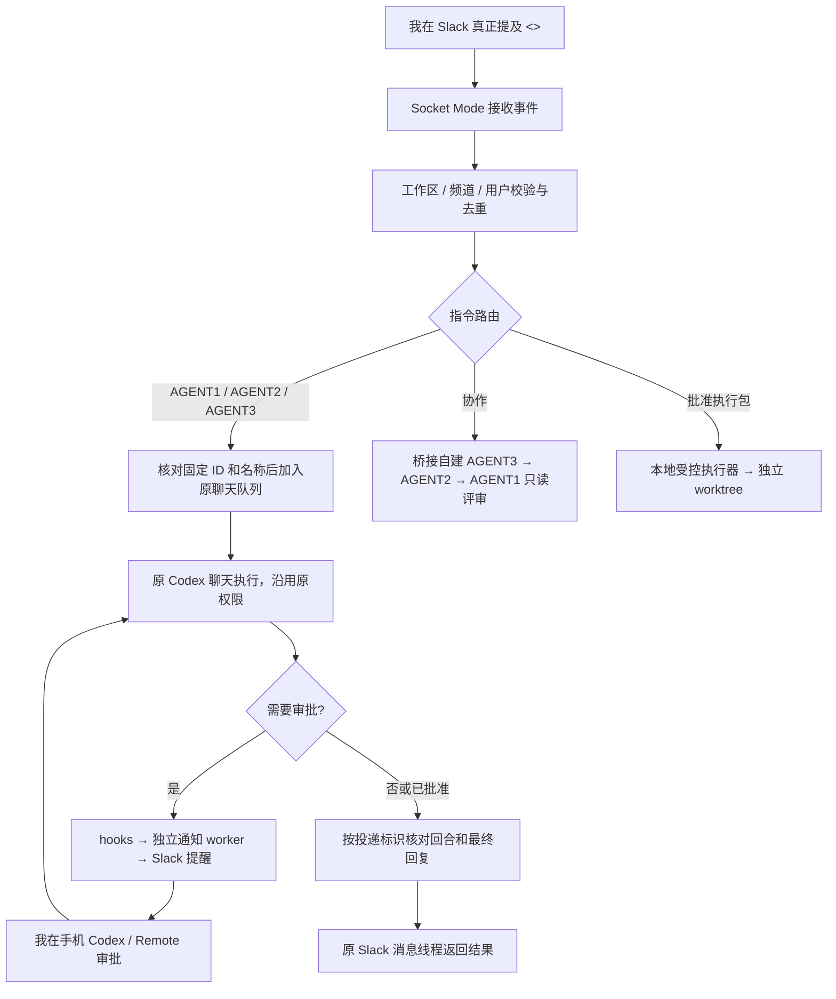

# Slack → 本地 Codex bridge：全过程

[English](../en/01-process.md)

## 1. 要解决的问题

我希望通过 Slack 向已有的本地 Codex 聊天发任务，沿用原聊天的历史、权限和项目约束。需要批准时，我在 Slack 收到提醒，在手机上处理，完成后再收到回复。

我最终采用 **Slack Socket Mode、固定原聊天 ID 和本地消息队列**。bridge 将指令加入队列，原聊天的执行连接继续处理。它不接管原聊天，也不增加文件或命令权限。

我使用 Socket Mode，让本机主动连接 Slack WebSocket，不需要开放公网 HTTP 接收端口。[Slack 官方说明](https://docs.slack.dev/apis/events-api/using-socket-mode/)

## 2. 我区分的四种功能

| 能力 | 谁执行 | 历史与权限 | 验证边界 |
|---|---|---|---|
| 桥接自建角色协作 | bridge 创建/继续的 Codex 角色会话 | 独立于桌面原聊天；只读评审 | 协作返回正常不证明原桌面 Agent 收到指令 |
| 原聊天双向通信 | 桌面原聊天持有的执行连接 | 固定原 ID，沿用原聊天历史和审批 | 入队、执行、最终回复、Slack 反馈分别确认 |
| 桌面审批和结束通知 | hooks 捕获事件，worker 发 Slack | 不返回批准决定 | 通知成功不证明 Slack 可反向控制 |
| Executor 批准执行 | 本地宿主校验模型提出的结构化修改 | 精确文件范围，独立 worktree | 离线模拟通过不代表真实业务验收 |

我未能成功连接 ChatGPT Web 中的原聊天。

## 3. 方案演进

### 阶段一：已有只读桥接与 0.2.0 受控执行

我最初通过 bridge 创建了 AGENT3、AGENT2、AGENT1 三个独立角色。“协作”按顺序调用，最多三次，将只读文件快照和前一个角色的结论交给下一个角色。这些会话与桌面原聊天分开。

我从已有的 0.1.3 开始，随后加入受控写入：模型返回结构化修改，本地执行器检查后写入独立 worktree，不向模型开放任意 shell 执行。

我在执行包中记录批准人、Slack 线程、基线、允许修改的文件、包 hash、有效期和一次性执行状态。我让执行器在执行前保存 claim，结束后先保存结果再发 Slack，避免崩溃或消息发送失败导致模型重复执行。

我补上工具目录过滤、完整 SSE 验证、继承配置检查和 Windows 句柄锁定，并拒绝 reparse/hardlink 路径。首次升级被旧守护程序健康检查误判失败，安装器恢复了 0.1.3。我保留旧健康标记后成功安装 0.2.0，并核对安装记录：120/120 离线测试通过，真实 SDK 固定响应模拟落盘成功，回滚预检通过。我没有验证真实模型写入、提交、推送或部署。

### 阶段二：从 Slack 直接审批转为通知 + 手机审批

我最初想从 Slack 批准 Codex 桌面的权限弹窗。0.2.1 候选只处理 bridge 自己持有的请求，并仅允许既有范围内的只读权限；18 项新增测试通过，但全套 130/138 通过，因此我没有安装这个候选版本。它不能接管任意桌面原聊天的弹窗。

我随后改用 Slack 文字提醒、手机批准和执行结束通知。我部署了独立通知程序，注册并信任 `PreToolUse`、`PermissionRequest`、`PostToolUse`、`Stop`、`SubagentStop`、`Interrupt` hooks。

我在测试中收到了审批等待提醒和结束简报，又在独立桌面测试聊天中完成手机批准，核对固定回复与 Slack 简报，确认这条流程可用。hooks 本身不读机器人凭据、不联网、不返回审批决定；worker 使用本地配置发通知。

### 阶段三：确认任务进入原聊天

我想接入 AGENT2、AGENT1 的现有 Codex 聊天，以及 ChatGPT Web 中的原聊天。我最初把三条示例放入同一 Slack 消息，结果被当作一个任务；角色协作结果也只来自桥接自己的会话。我因此把“消息出现在指定原聊天中”作为通信验收条件。

我核对了 AGENT2 和 AGENT1 的固定 ID，后来确认另一目标聊天位于 ChatGPT Web。我让早期原聊天路由明确报告“未投递”，避免请求静默落到新的角色会话。

### 阶段四：连接控制接口和失败的恢复路线

我使用的 Codex/SDK 基线为 0.160.0。`app-server proxy` 探针最初在 initialize 超时；我补上 WebSocket Upgrade 握手后连接成功。独立 daemon 能读取原 ID，但显示 `notLoaded`，不能由此认为桌面聊天没运行。

我查到桌面服务使用内部 stdio 连接，独立 daemon 使用可连接的控制 socket。我能读取保存记录，但这不代表我持有桌面写入连接。

我在恢复测试前备份原聊天、索引一致性快照、hooks 和 bridge，并记录业务项目的 worktree 状态。过程中出现响应大小限制、RPC 参数错误和恢复拒绝；原记录和项目状态均保留。

我曾把原 AGENT2 恢复失败归因于 `paginated` 历史，后来发现 `readOnly` 参数也写错，因此无法确认历史格式是唯一原因。我在独立新聊天测试中还遇到空聊天未持久化、过时权限字段、source filter 不匹配、侧栏不可见等问题。

我后来在独立测试聊天中实现了 Slack 往返及持久化，但没有验证桌面可见性。桌面新建的测试聊天报 `already has an active writer`；我切换聊天后，占用仍未释放。我停止尝试恢复和接管，保留进程、锁和历史来源。

### 阶段五：用队列接入原桌面聊天

我在 0.160.0 schema 中发现了 `thread/queue/*`。我让连接声明 `experimentalApi:true` 后，队列只读查询成功。随后向桌面测试聊天调用 `thread/queue/add`，消息出现在原聊天并由其回复，无需 `thread/resume` 或启动另一执行连接。

我先接入 Slack 固定测试入口：原聊天收到了消息并回复，但 bridge 曾误报 FAILED。我修复了“等待最终答复”的结果判断，又解决了 PowerShell 脚本编码、JSON 读取编码和 JSON BOM，测试记录随后返回 SUCCEEDED。

我接入 AGENT1 和 AGENT2 时，核对 ID、名称、队列、历史路径并备份，再修复 Windows `\\?\` 路径误判。两角色投递成功，但曾把短暂 `interrupted` 当终态；我加入稳定状态检查、状态复查和混合角色指令拒绝，之后分别返回 `TURN_COMPLETED` 与原聊天最终答复。

### 阶段六：通用路径、自启动与 AGENT3

我去掉用户目录硬编码，按当前 Windows 用户定位 daemon/socket，并登记登录后的启动入口。启动检查通过了，但我还没有验证实际重启后的往返。

我最初通过 Slack 连接器发送 AGENT3 的测试信息，这只证明出站成功。我加入 AGENT3 队列路由后，安装因复制旧离线测试临时目录而触发 262 字符长路径；我改为只复制正式测试文件后，安装成功。

我随后确认原 AGENT3 聊天收到带 `SlackDelivery-…` 的 Slack 指令并返回输出信息。状态文件也记录了 TURN_COMPLETED 和输出信息，这些结果让我确认消息已进入原聊天。

## 4. 最终角色绑定

| Slack 指令 | 原聊天 | 固定 ID | 结果 |
|---|---|---|---|
| `AGENT1：…` | `ORIGINAL_AGENT1_TITLE` | `THREAD_ID_AGENT1` | 历史联调往返通过 |
| `AGENT2：…` | `ORIGINAL_AGENT2_TITLE` | `THREAD_ID_AGENT2` | 历史联调往返通过 |
| `AGENT3：…` | `AGENT3` | `THREAD_ID_AGENT3` | 原聊天收到并回复；当前源码包含绑定 |
| ChatGPT Web | 网页端原聊天 | 已识别，仓库不保留私人网址 | 未接入；不能替换成新 Codex 聊天冒充 |

我用匿名化占位符代替了表中的 ID，它们不能直接用于配置。名称变化也可能触发身份校验失败；不能仅改一处 ID 绕过校验。

## 5. 我采用的原聊天路由顺序

我让路由按以下顺序处理消息：

1. 上游校验 Slack 工作区、频道、允许用户并去重。
2. 解析真正提及和单角色指令；拒绝混合角色正文。
3. 根据 Slack team/channel/messageTs/user 生成 deliveryId；已有记录不重投。
4. 核对原聊天固定 ID 和名称；检查队列为空、旧任务已确认终态、配额允许。
5. 先落盘 `CLAIMED` 与角色锁，再向队列写入带唯一 `SlackDelivery-…` 的消息。
6. 收到队列确认后保存 `QUEUED`，向 Slack 报告等待执行。
7. 用 marker 查原聊天回合；确认 completed 和 final_answer 后保存 `TURN_COMPLETED`。
8. 超时保存 `PENDING`；异常可能为 `UNKNOWN`。通过状态查询核对已有回合，不自动重投。
9. 最终回复与回合状态返回原 Slack 线程，业务成功仍需独立验收。

我把失败或中断的确认条件设为连续五次读到相同的 failed/interrupted 签名；completed 还必须有 final_answer。这解决了测试中遇到的误报，但后续版本仍可能出现状态竞态。

## 6. 权限原则

我在原聊天指令中加入“遵循已有权限、审批要求和项目约束；不额外授予权限”。因此原聊天可用能力由其已有配置决定，我没有把桥接自建角色的只读限制当作原聊天的强制只读保证。

我把 Executor 执行包批准、Codex 权限卡片批准和队列任务投递作为三个独立的核验项。协议和客户端可能变化，我以部署版本的 schema 和实际往返判断实验性队列能力。我在官方公开 App Server 页中没有找到 `thread/queue/add`，因此依据部署版源码和实测结果核对细节，不把它当作跨版本稳定的公开 API。[App Server 官方文档](https://learn.chatgpt.com/docs/app-server)
